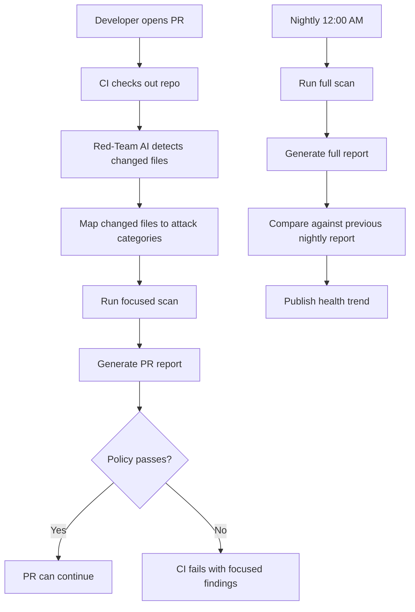

# PR-Aware Red-Team Scanning PRD

Author: Smital Lunawat

## Summary

Red-Team AI already maps attack categories to the security surface of a target application. The next step is to make that capability practical for day-to-day engineering by adding PR-aware scanning:

- On pull requests, run a fast focused scan based on files changed in the PR.
- On a nightly schedule, run the full scan across the whole target application.
- Compare nightly reports over time to show security health, new vulnerabilities, fixed vulnerabilities, and score trends.

This gives developers fast feedback without losing whole-system coverage.

## Problem

Red-Team AI has a large attack space: many categories, many strategies, adaptive rounds, multi-turn attacks, and LLM-based judging. That breadth is valuable for deep assessments, but it can be expensive for every pull request.

Today, the scanner can skip categories that do not map to any relevant source files in the target app. That answers:

> Which attack categories are relevant to this application?

It does not answer:

> Which attack categories are relevant to this code change?

For CI, that distinction matters. A small PR that changes JWT handling should receive immediate auth/session/RBAC-focused feedback. A small PR that changes RAG retrieval logic should receive RAG/tenant/citation-focused feedback. Neither PR should wait for a full broad scan unless the team explicitly asks for one.

## Goals

- Reduce PR scan time by running only attack categories relevant to changed files.
- Preserve full security coverage through scheduled full scans.
- Make scan outcomes easy for developers to understand in CI.
- Give security and engineering leadership trend visibility through nightly scan comparison.
- Reuse the existing category/file relevance mapping and attack pipeline where possible.

## Non-Goals

- Replace full scans with PR scans.
- Guarantee that changed-file scanning catches all systemic vulnerabilities.
- Build a full hosted CI product in the first iteration.
- Build a full SARIF/code-scanning integration in the first iteration.
- Build persistent attack memory in this feature, though the design should not block it later.

## Current State

The project already has several important building blocks:

| Capability | Current State |
|---|---|
| Attack category catalog | Exists |
| Manual category selection | Exists through `attackConfig.enabledCategories` |
| Codebase analysis | Exists |
| Category-to-source-file relevance mapping | Exists through `analysis.affectedFiles` |
| Skip irrelevant categories | Exists through `skipIrrelevantCategories` |
| Adaptive rounds | Exists |
| JSON/Markdown reports | Exists |
| PR changed-file detection | Missing |
| Changed-file-to-category focused scan | Missing |
| Nightly full-scan workflow | Missing as first-class workflow |
| Report-to-report comparison | Missing |

## Proposed Experience

### Pull Request Scan

When a developer opens or updates a PR:

1. CI checks out the target application repo.
2. Red-Team AI computes changed files against the base branch.
3. The scanner maps those changed files to attack categories.
4. The scanner runs only the selected attack categories.
5. The report explains which files selected which categories.
6. CI passes or fails based on the configured policy.

Example output:

```text
PR-aware scan enabled
Base ref: origin/main
Changed files:
  src/auth/jwt.ts
  src/api/refunds/route.ts

Selected categories:
  auth_bypass             src/auth/jwt.ts: authentication logic
  session_hijacking       src/auth/jwt.ts: session/token management
  rbac_bypass             src/api/refunds/route.ts: permission enforcement
  agentic_workflow_bypass src/api/refunds/route.ts: multi-step approval workflow
  financial_fraud_facilitation src/api/refunds/route.ts: financial transaction flow

Planning attacks for 5 focused categories instead of 141.
```

If changed files do not map to any attack category, the PR scan should not silently run a generic baseline set. Instead, it should exit clearly:

```text
PR-aware scan enabled
Changed files:
  src/utils/date-format.ts

No attack categories mapped to the changed files.
Focused attack execution skipped.
Nightly full scan remains responsible for whole-application baseline coverage.
```

Documentation and markdown changes should not be skipped automatically. In AI applications, documentation, policy files, README content, support articles, and knowledge-base markdown can become prompt-injection or RAG-poisoning attack surfaces when agents read repo files or indexed docs.

### Nightly Full Scan

At midnight, CI runs the full scan without PR filtering:

1. Scan the full target application.
2. Generate the normal report.
3. Compare with the previous nightly report.
4. Publish health trend and regression summary.

Example nightly summary:

```text
Nightly security health
Score: 82 -> 87 (+5)
New vulnerabilities: 1
Fixed vulnerabilities: 4
Persistent vulnerabilities: 7
Highest-risk regression: cross_tenant_access
```

## User Personas

| Persona | Need |
|---|---|
| Individual contributor | Fast, relevant feedback on their PR without waiting for a full red-team run |
| Staff engineer | Confidence that PR checks cover likely changed risk areas |
| Security engineer | Nightly broad coverage and trend reports |
| CTO/VP Engineering | Security health over time and merge-risk visibility |

## Product Flow



## Current vs Proposed

| Area | Current | Proposed |
|---|---|---|
| Category selection | Manual config plus whole-app relevance gating | Manual config plus whole-app gating plus PR changed-file focus |
| PR scan cost | Can still be broad for a large app | Narrowed to changed security surface |
| Developer feedback | Security score and report after scan | Security score plus why these categories were selected |
| Whole-repo health baseline | Manual/full scan when configured | First-class nightly full scan workflow |
| Trend visibility | Individual reports | Comparative nightly health analysis |

The PR scan is not the baseline. It is a fast risk check for the current change. The nightly full scan is the baseline for whole-application security health.

## Why This Matters

This feature makes Red-Team AI behave like a practical DevSecOps scanner for AI systems:

- Fast checks on PRs.
- Deep checks on a schedule.
- Clear explanations for developers.
- Historical visibility for leadership.

Traditional scanners such as Trivy popularized the idea that security checks must be CI-friendly and target-aware. Red-Team AI can apply that same workflow to AI-agent security, where the "scanners" are attack categories such as `auth_bypass`, `tool_misuse`, `rag_poisoning`, and `cross_tenant_access`.

## Risks And Tradeoffs

| Risk | Impact | Mitigation |
|---|---|---|
| Changed-file scan misses systemic effects | PR scan may pass even though full app has a regression | Keep nightly full scan mandatory |
| File-to-category mapping is imperfect | Wrong categories may be selected or missed | Show selected categories and reasons; allow manual override |
| CI setup complexity | Teams may not configure base refs correctly | Provide GitHub Actions example and safe defaults |
| LLM scan still takes time | Focused scans are faster but not instant | Keep category and attack limits configurable |
| No baseline comparison in first slice | PR scan may not distinguish old vs new vulnerabilities | Add report comparison as second milestone |
| Unmapped changed files skip attacks | A risky change could be missed if mapping is incomplete | Make the skip explicit in the report and rely on nightly full scans for baseline coverage |

## Success Metrics

- PR scan runs fewer categories than a full scan on typical small PRs.
- PR scan output clearly explains changed files and selected categories.
- Developers can configure the feature without custom shell glue.
- Nightly scan comparison reports score movement and new/fixed vulnerabilities.
- The feature reuses existing code paths instead of creating a parallel runner.

## Release Plan

| Phase | Scope | Outcome |
|---|---|---|
| Phase 1 | Config-enabled PR-aware focused scan | Changed files select attack categories through saved scan settings |
| Phase 2 | CLI flag and GitHub Actions docs/template | Teams can wire PR and nightly workflows with one-off overrides |
| Phase 3 | Separate report comparison utility | Security health trend and regression summary |
| Phase 4 | Optional SARIF output | Findings appear in GitHub Code Scanning |

## Product Decisions

| Question | Decision |
|---|---|
| Enablement model | Start with config-based enablement; add CLI flags later for one-off overrides |
| No changed-file matches | Do not run fallback attacks; report that no categories mapped and skip focused attack execution |
| Docs-only changes | Do not automatically skip; docs can be prompt-injection, repo-injection, or RAG-poisoning surfaces |
| Focused scan vs baseline | Focused PR scan catches likely change-local risk; nightly full scan owns whole-app baseline health |
| Nightly comparison location | Start as a separate report utility rather than adding comparison logic to the main scan command |
| CI failure policy | Phase 1 can fail on focused scan policy/score; Phase 3 can support "new vulnerabilities only" through report comparison |
