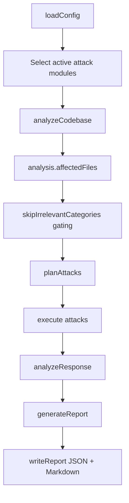
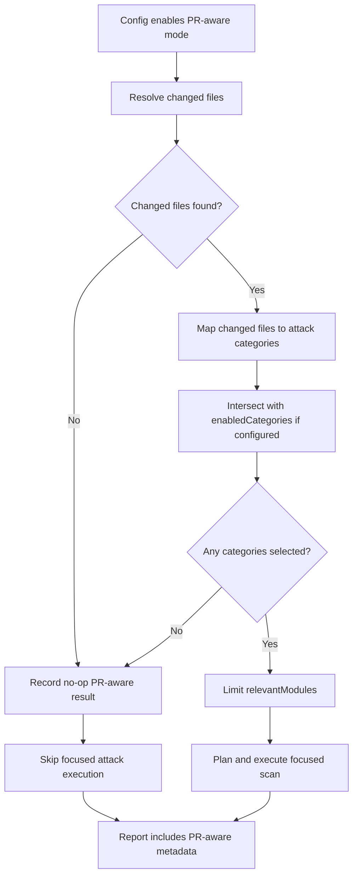
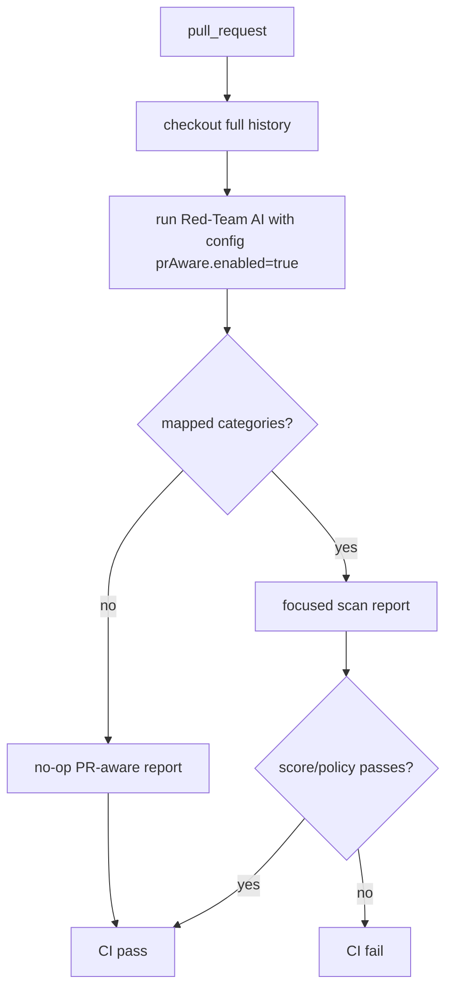
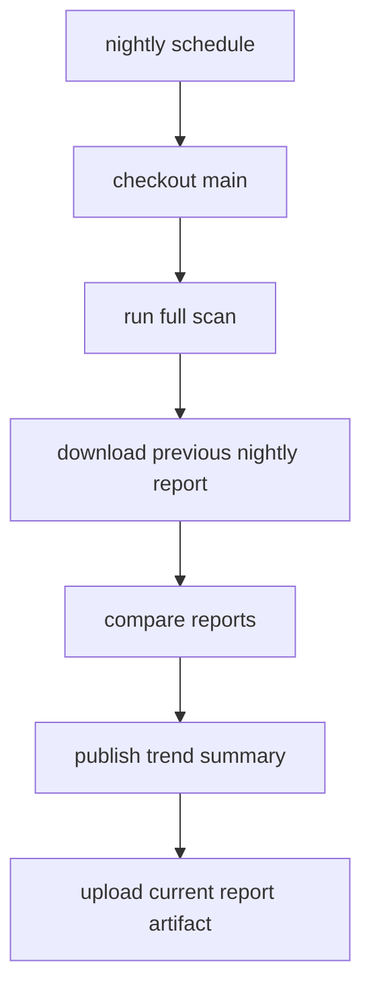
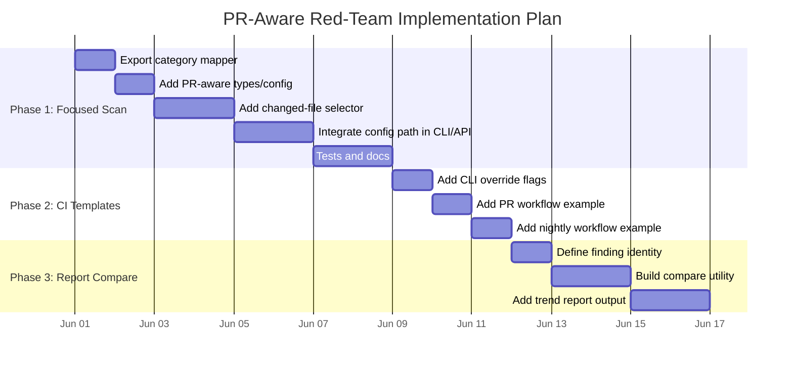

# PR-Aware Red-Team Scanning Technical Design

Author: Smital Lunawat

## Objective

Add a CI-friendly focused scan mode that uses git changed files to select relevant attack categories, while preserving full nightly scans and enabling report-to-report comparison.

## Existing Architecture

The current run pipeline is:



Important existing files:

| File | Current Role |
|---|---|
| `lib/types.ts` | Config, report, attack, and analysis types |
| `lib/config-loader.ts` | Config defaults and validation |
| `lib/codebase-analyzer.ts` | Codebase scan, smart context, affected-file mapping |
| `red-team.ts` | CLI orchestration |
| `lib/run.ts` | Programmatic/dashboard run orchestration |
| `lib/report-generator.ts` | JSON/Markdown report generation |

## Gap

The current scanner maps categories against the entire codebase:

```text
all files -> affected categories -> skip categories with no matching files
```

PR-aware mode needs:

```text
changed files -> affected categories -> focused scan categories
```

The existing mapper is close, but it is private to `lib/codebase-analyzer.ts` and always receives the full file list.

## Proposed Architecture



## Config Design

Add optional config under `attackConfig`:

```ts
prAware?: {
  enabled?: boolean;
  baseRef?: string;
  changedFiles?: string[];
  includeDeletedFiles?: boolean;
};
```

Suggested defaults:

```json
{
  "attackConfig": {
    "prAware": {
      "enabled": false,
      "baseRef": "origin/main",
      "includeDeletedFiles": false
    }
  }
}
```

Phase 1 is config-first. Teams enable the feature in the scan config so CI has a repeatable source of truth. CLI flags such as `--pr-aware` and `--base-ref` can be added in Phase 2 as one-off overrides, but they are not required for the first implementation.

Why support `changedFiles` directly:

- GitHub Actions can compute files externally.
- API/dashboard clients may not run inside a git checkout.
- Tests can avoid shelling out to git.

## New Module

Add `lib/pr-aware.ts`.

Responsibilities:

- Resolve changed files from config or git.
- Normalize paths.
- Filter deleted/nonexistent files when configured.
- Map changed files to attack categories.
- Produce explainable selection metadata.

Proposed types:

```ts
export interface PrAwareSelection {
  enabled: boolean;
  baseRef?: string;
  changedFiles: string[];
  selectedCategories: AttackCategory[];
  reasons: {
    category: AttackCategory;
    file: string;
    line?: number;
    reason: string;
  }[];
  skipped: boolean;
  skipReason?: string;
}
```

## Refactor Existing Mapper

Current private function:

```ts
function mapCategoriesToFiles(
  basePath: string,
  files: string[],
): Partial<Record<AttackCategory, AffectedFile[]>>
```

Proposed change:

```ts
export function mapCategoriesToFiles(
  basePath: string,
  files: string[],
): Partial<Record<AttackCategory, AffectedFile[]>>
```

This lets PR-aware mode reuse the exact same relevance logic as full-codebase analysis.

## Runtime Integration

Both orchestration paths need the same behavior:

- CLI: `red-team.ts`
- Programmatic/dashboard: `lib/run.ts`

Integration point:

1. Load config.
2. Analyze codebase.
3. Compute existing `relevantModules`.
4. If PR-aware mode is enabled, further filter `relevantModules` by selected categories.
5. Continue with existing planning/execution.

Pseudo-code:

```ts
const prAware = await selectPrAwareCategories(config, analysis);

if (prAware.enabled) {
  reportMetadata.prAware = prAware;
  if (prAware.skipped) {
    relevantModules = [];
  } else {
    const selected = new Set(prAware.selectedCategories);
    relevantModules = relevantModules.filter((m) => selected.has(m.category));
  }
}
```

The implementation should guard against accidentally running the full scan when PR-aware mode resolves no categories. In Phase 1, "no mapped categories" means no focused attack execution.

## Git Changed File Detection

Recommended command:

```bash
git diff --name-only --diff-filter=ACMR origin/main...HEAD
```

Why `ACMR`:

- A: added
- C: copied
- M: modified
- R: renamed

Deleted files should not usually trigger runtime attacks because there is no current code surface to scan. Teams can enable deleted files later if desired.

Fallbacks:

| Situation | Behavior |
|---|---|
| `changedFiles` supplied in config | Use config directly |
| Git command succeeds | Use git output |
| Git command fails | Mark PR-aware selection as skipped with a clear error reason |
| No changed files | Mark PR-aware selection as skipped: no changed files |
| Changed files map to no categories | Mark PR-aware selection as skipped: no mapped categories |

This design intentionally avoids fallback categories in Phase 1. If a focused scan cannot confidently map the change to categories, it should say so rather than run unrelated attacks and imply the PR was meaningfully covered.

Markdown and documentation files should remain eligible for mapping. They can select categories such as `repo_prompt_injection`, `indirect_prompt_injection`, `rag_poisoning`, `rag_corpus_poisoning`, `tool_result_injection`, and `sensitive_data` when the content/path patterns indicate that the target may ingest docs, repo files, or knowledge-base content.

## Report Metadata

Extend `Report` with optional metadata:

```ts
runContext?: {
  mode?: "full" | "pr_aware";
  prAware?: PrAwareSelection;
};
```

This makes reports self-explaining:

- Which changed files were considered.
- Which categories were selected.
- Whether focused attack execution was skipped.
- Why each category was selected.

## Nightly Full Scan

Nightly scans should not use PR-aware filtering.

Example GitHub Actions trigger:

```yaml
on:
  schedule:
    - cron: "0 8 * * *" # 12:00 AM Pacific during standard time
  workflow_dispatch:
```

The nightly workflow runs the existing full scan config and stores the report artifact.

## Report Comparison

Add a utility in a later phase:

```text
report A + report B -> comparison report
```

Proposed command:

```bash
npm run compare-reports -- report/nightly-prev.json report/nightly-current.json
```

This should start as a separate report utility rather than being added to the main scan command. The scanner's core CLI runs attacks; the report utility compares completed reports. Keeping these concerns separate reduces implementation risk and makes the comparison reusable for nightly scans, manual scans, and future dashboard workflows.

Comparison dimensions:

| Metric | Description |
|---|---|
| Score delta | Current score minus previous score |
| New vulnerabilities | Findings present now but not before |
| Fixed vulnerabilities | Findings present before but absent now |
| Persistent vulnerabilities | Findings present in both |
| Category movement | Per-category score/count changes |
| Severity movement | Critical/high/medium/low count changes |

Finding identity can start with:

```text
category + attack name + affected file + normalized description
```

This is not perfect, but good enough for an initial trend report.

## CI Workflows

### PR Workflow



### Nightly Workflow



## Implementation Plan



## Test Plan

Unit tests:

- `mapCategoriesToFiles` returns expected categories for representative files.
- PR-aware selector uses provided `changedFiles`.
- PR-aware selector marks selection skipped when git fails.
- PR-aware selector intersects with manual `enabledCategories`.
- Deleted files are ignored by default.
- Markdown/doc changes can map to prompt-injection/RAG/repo-injection categories.

Integration tests:

- Focused scan with changed auth file selects auth/session categories.
- Focused scan with changed RAG file selects RAG/retrieval categories.
- Focused scan with no matches skips focused attack execution and records why.
- Full scan behavior is unchanged when PR-aware mode is disabled.

Regression checks:

- `npm run typecheck`
- `npm test`

## Rollout

1. Ship disabled by default.
2. Document config-based usage first.
3. Add CLI flags after config behavior is stable.
4. Add GitHub Actions examples.
5. Add dashboard/API support once CLI path is stable.
6. Add report comparison as a separate utility.

## Alternatives Considered

| Alternative | Why Not First |
|---|---|
| Always run full scan on every PR | Highest coverage but slow and costly |
| Rely only on manual `enabledCategories` | Requires users to know the right categories |
| Build report comparison first | Valuable, but does not reduce PR scan cost |
| Build SARIF first | Good integration, but does not solve scan duration |
| Build persistent attack memory first | High value, but larger architectural change |

## Key Design Principle

PR-aware scanning is a narrowing layer, not a separate scanner. It should reuse:

- existing codebase analysis
- existing category/file mapping
- existing attack modules
- existing planner
- existing runner
- existing reports

That keeps the feature understandable and lowers merge risk.
